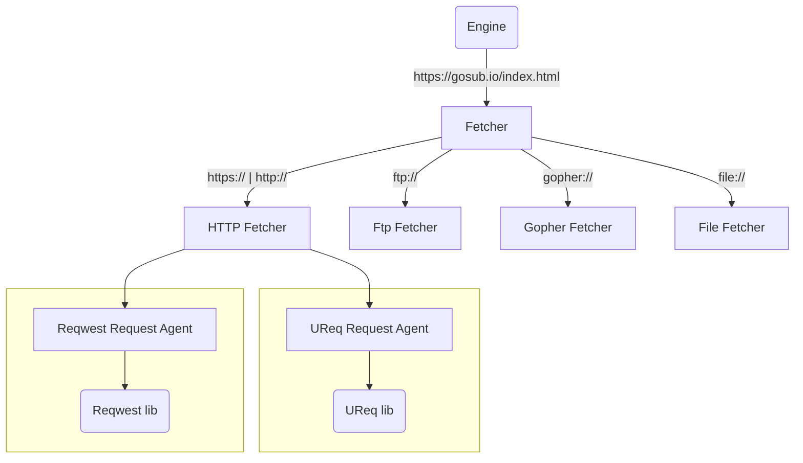

The fetcher system is responsible of fetching "data" from the given URL. The data could be anything from a protocol that the engine supports.
Usually, this is the HTTP protocol which fetches HTTP responses from the given URL, but it could also be a local file, gopher, ftp or other 
protocols that are able to be fetched from within a browser.

A fetcher could have multiple ways to fetch data. In this case, the RequestAgents are responsible for fetching the data from the given URL.
A RequestAgent is normally a wrapper around a low-level library that does the actual fetching. For instance, the `UReq` RequestAgent is a wrapper
around the `ureq` library, which is a lightweight HTTP client for Rust. The `Reqwest` RequestAgent is a wrapper around the `reqwest` library, which
is a more feature-rich HTTP client for Rust.

Some fetchers only use a single library, and in that case, there is no request agent, but the code is directly called in the given fetcher.

